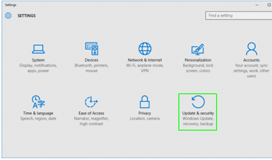
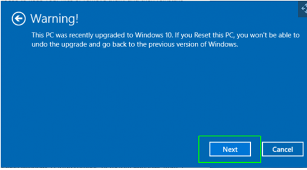

# Autopilot Imaging

1. Navigate to Settings.  You can get there by clicking the gear icon on the Start menu.

2. Select "Update & security"

3. Click Recovery and "Get started" under Reset this PC.
  * If you cannot login the PC, you can also reset on window login screen. Click power icon and click restart with Shift key. 

4. Click "Remove everything," 

5. Select "Just remove my files" 

6. Click Next if Windows warns you that you won't be able to roll back to a prior version of the OS.

7. Click Reset when prompted. And Windows will then restart and take several minutes to reset itself.

8. Click Continue when prompted.
The computer should start resetting
After a couple of reboots, you will be presented with a fresh install of Windows 10

9. In enterprise enviroment, you have to enroll PC after reset
Couple of restarts you will be presented with Welcome screen.
Enter User organization email address then click on Next

10. Sign in with AD joined Account
Authenticate if any Multifactor authentication (MFA) enable in your Organization like Symantec VIP/ PING ID etc.
Note: Multifactor authentication (MFA) App configuration should be done before start device resetting

11. Lets completes all 3 phases of device setup for work

