# Clonezilla

Link [Clonezilla](https://clonezilla.org/downloads/download.php?branch=alternative)

There is 2 version Alternative and stable each one is Ubuntu and Debian.
Ubuntu version also support UEFI secure boot.

If you received the zip file, run unzip to USB as it is, and if you received the ISO file, mount it and copy the contents to USB as it is. All files and folders must be released to the top-level directory on the USB. Assuming that USB is a U drive, folders such as boot, EFI, and home should be visible when you enter the U drive.

## Clonezilla image backup

01. select language

02. The keymap setting screen appears. Most select the default value of Don't touch keymap and move on.

03. Start_Clonezilla

04. The mode selection screen appears. Select device-image to back up and recover the image.

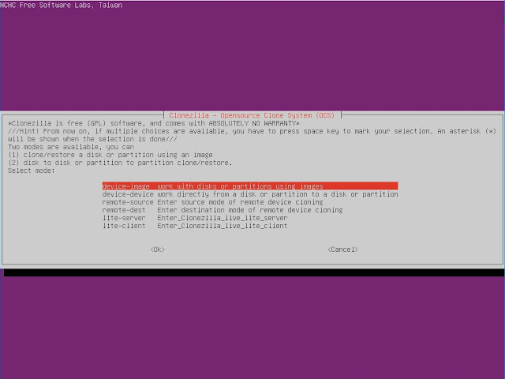

05. Set the location to save or import the backup image. Internal, external hard, etc. can be set in local_dev.

06. If you select a local device, you will be asked if you want to connect the USB to store the image separately.

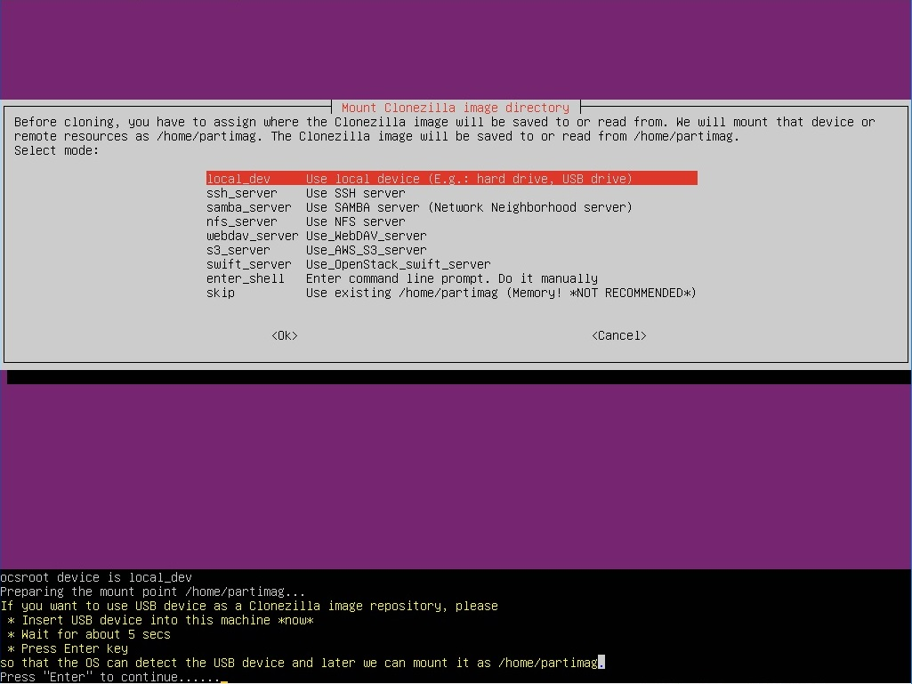

If you want to save the backup image by connecting a USB other than the boot USB, you can connect it now. Wait about 5 seconds for the USB to be recognized, and then press the Enter key. To skip, press Enter immediately.
A list of connected storage devices appears. You see sda and sdb.

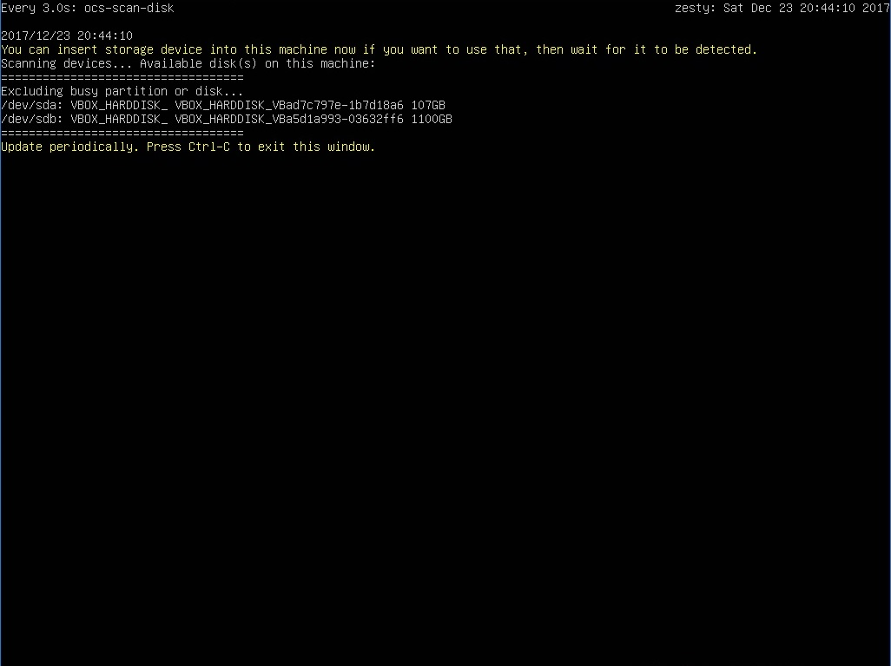

If you wait after inserting another storage device, it will appear on the screen. If you do not have a storage device to add, you can press Ctrl+C to proceed.

07. Select a partition to save or import the backup file. I will specify sdb1 (partition number 1 on the second disk).

08. Select a folder to save or import backup files.

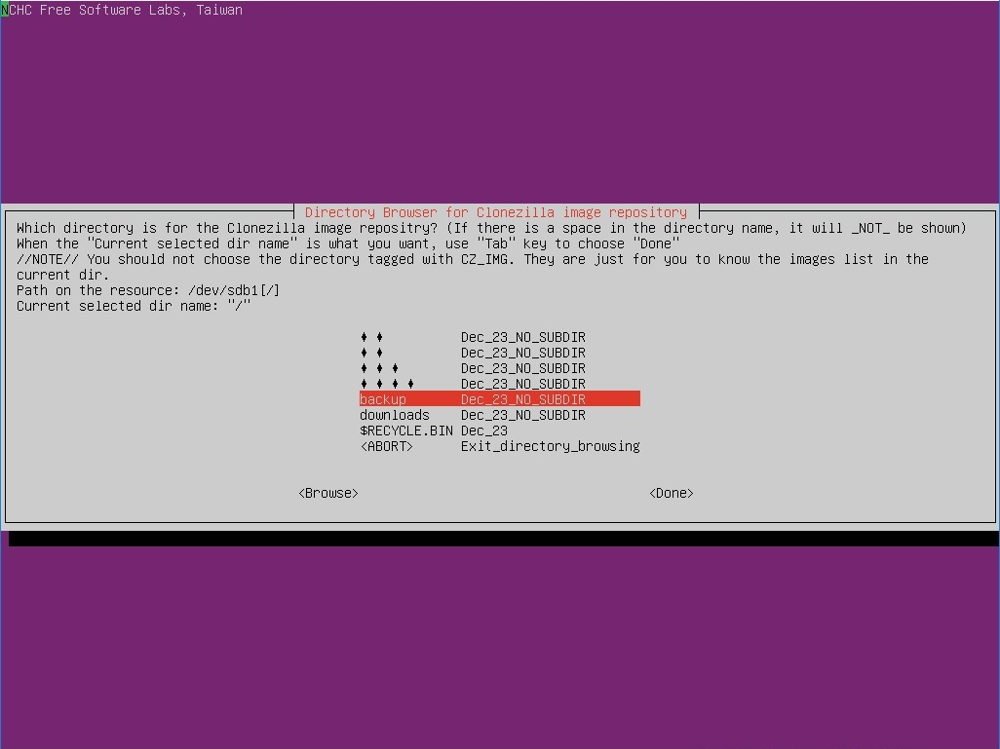

To save to the backup folder, navigate to the backup path by navigating to the direction key and pressing Enter.

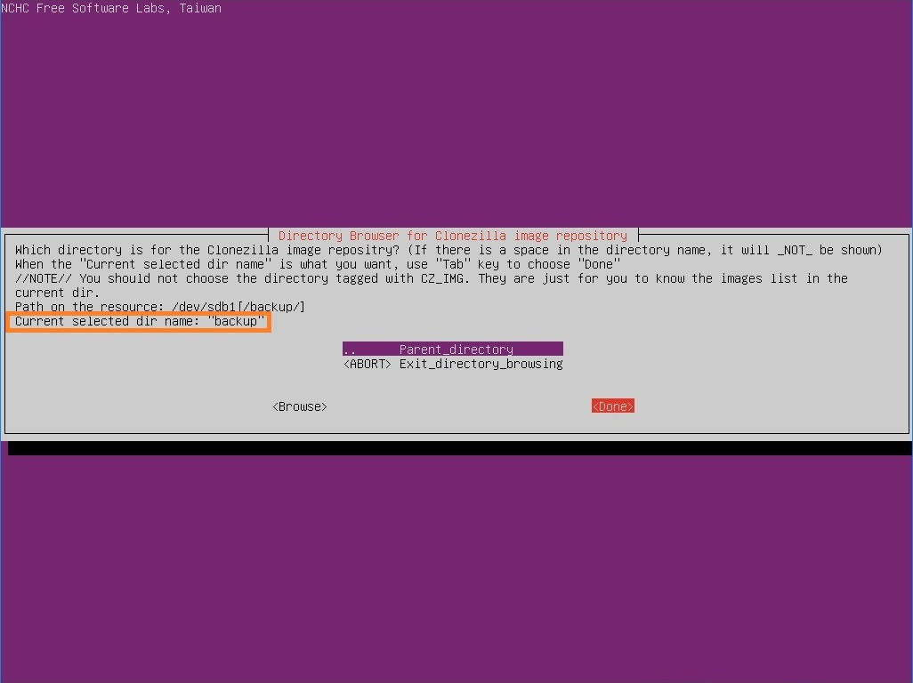

After confirming that the Current selected dir name is backup, go to the tab key and select Done. You will be prompted to mount sdb1.

09. Beginner mode and Expert mode can be selected. When you select Expert mode, you can select your own options later, such as backup program priority and compression method. Select Beginner to proceed to the default. Let's choose Expert here.

10. This is the task selection screen. If no images are backed up, only two options appear: savedisk and saveparts.

* Back up the saveddisk:disk. Back up all data, including the partition configuration, to an image.
* saveparts: Select and back up the partition yourself.
* restoredisk: recover an image backed up by savedisk by covering the entire disk.
* restoreparts: Recover selected partitions from images backed up with savedisk and saveparts.

It's normal to back up the entire system with savedisk, but here we'll use saveparts to select the partitions ourselves. If you select restore to proceed with the recovery, go to number 23.

11. Set the name of the image you want to save. The default values are date and time.

12. Select the partition you want to back up.

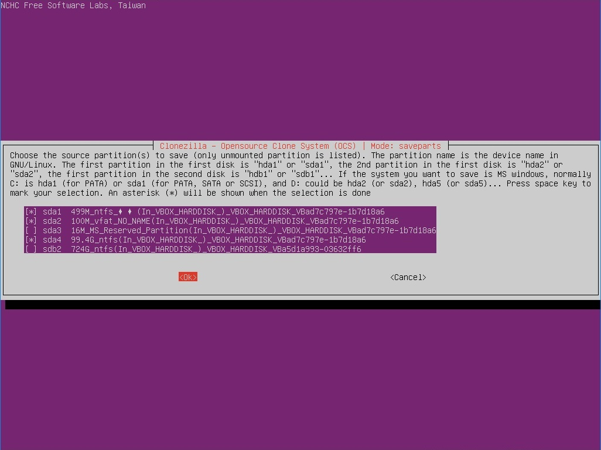

Space can be used to display a [*] in the blank space before the partition. You have selected a recovery partition, an EFI partition, and a C drive. The sda3 partition is an MS reserved partition, which is not necessary to include.

If you selected savedisk in step 10, you will be prompted to select the disks to be backed up, not each partition.

Expert mode. If you selected Expert mode in the previous step 9, additional options from 13 to 16 appear. You need to understand and choose what the choices mean. Usually, all but the file split option proceeds to the default.

13. You can prioritize clone programs. You don't have to change it, so press Enter to move on.

14. A number of options will appear for backup.

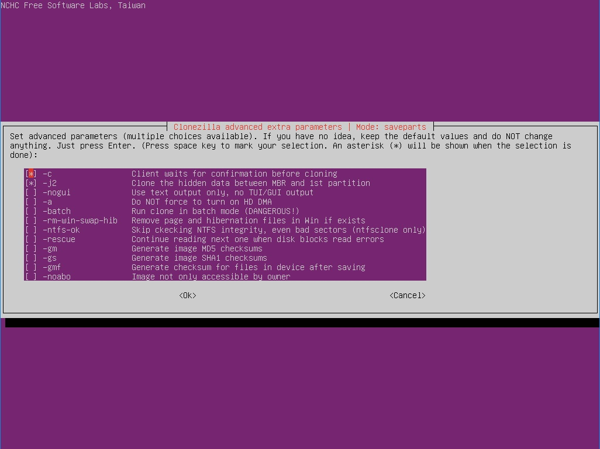

If you need any options, you can use the space bar to check. If you choose the default value, there is no problem, so press Enter immediately to move on.

15. Select the compression method. Select the default value as well.

16. Set file segmentation settings.

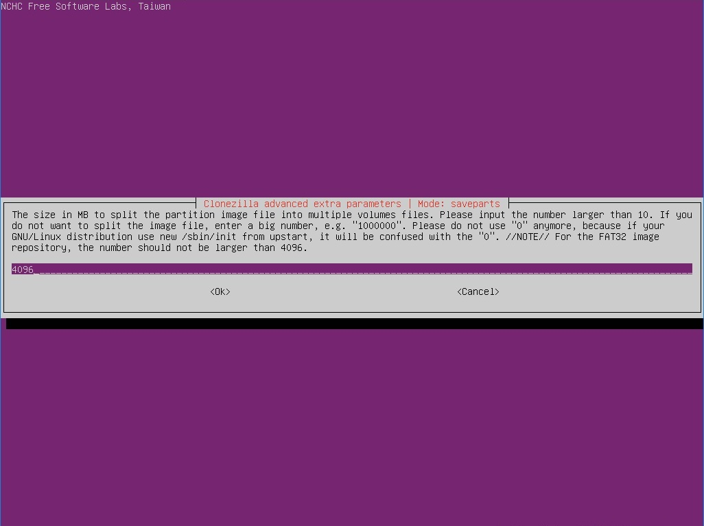

By default, the partition image is split and compressed to 4096 MB, and you can change its size. Enter a large number such as 1000000 to avoid splitting. If the partition where you want to save the backup is formatted with FAT32, do not replace it.

17. Check the partition for errors before backing up.

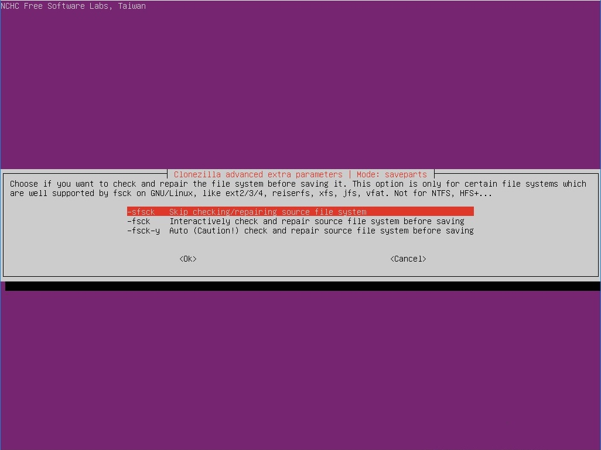

Examine the partition with the command fsck used by Linux. Because NTFS format cannot be scanned, if you back up Windows, select Default to skip.

18. Check that the image files created after the backup are recoverable. Select Yes as the default.

19. Set whether or not to encrypt the image. Select the default, Not to encrypt the image. If you encrypt the image, you can enter the password in a few minutes.

20. Set up what to do after everything is done. You can choose either reboot or poweroff. If you choose Choose, the option will appear again after the backup is over.

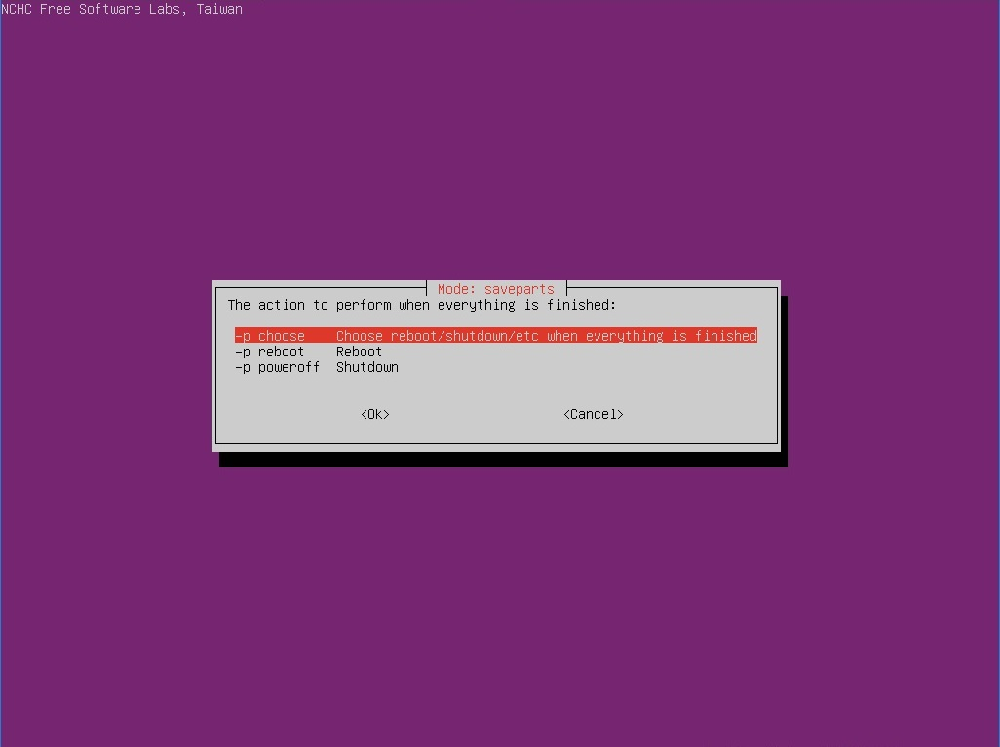

21. This is your last chance to cancel the backup before you start it. Type y to start the backup.

22. After the backup completes, the job you selected in step 20 runs. If you select reboot, a message will appear after counting down, when you remove the CD or USB and press Enter to complete all operations. Please note that depending on the system, it may reboot immediately after the countdown.

## Clonezilla image recovery

It's the same up to level 9. If you select restoredisk or restoreparts in step 10, recovery mode is enabled. We will proceed with the recovery by selecting restore parts.

23. Select the image you want to recover.

24. A list of partitions that you can recover appears. Select the desired partition as a space.

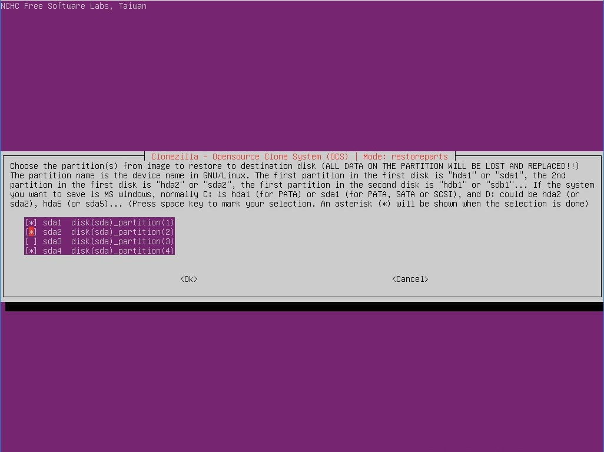

If you run the restored disk to restore the entire disk, this option does not appear and you select the disk you want to recover.

Expert mode. If you selected Expert in step 9, this is an option to select. Steps 25 through 26 appear, and there is no specific choice for recovery, so Beginner mode is recommended.

25. Select several recovery options similar to Step 14. If you keep the default value, it will recover without any problems.

26. Options for configuring partition tables. When recovering to a disk larger than the backed up disk, you can scale the partition to a percentage or manually adjust it. Leave the default value and proceed.

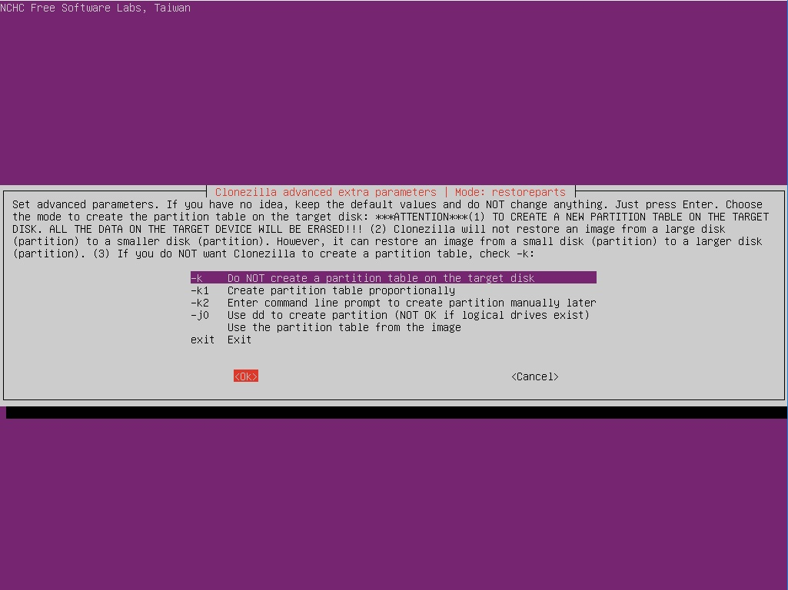

27. Check that the image is recoverable properly before proceeding with the recovery. It doesn't matter which one you choose, but it doesn't take long, so you'd better check it out.

28. Decide what to do after everything is done. When you select Choose, a selection window will appear after the restore is complete.

29. If you set the recovery availability check in step 27, the check runs.

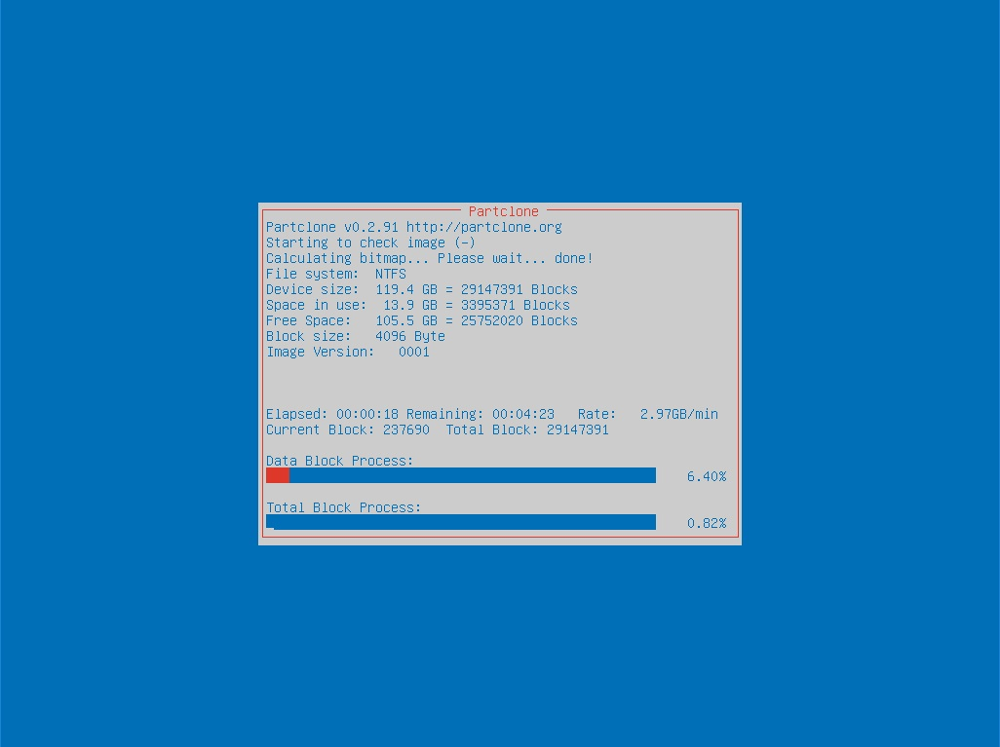

30. When the scan is complete, ask if you want to run it with a warning before starting the recovery. I asked twice, and after checking, enter y to proceed with the recovery. If you press n here to stop and continue, the next selection screen will appear.

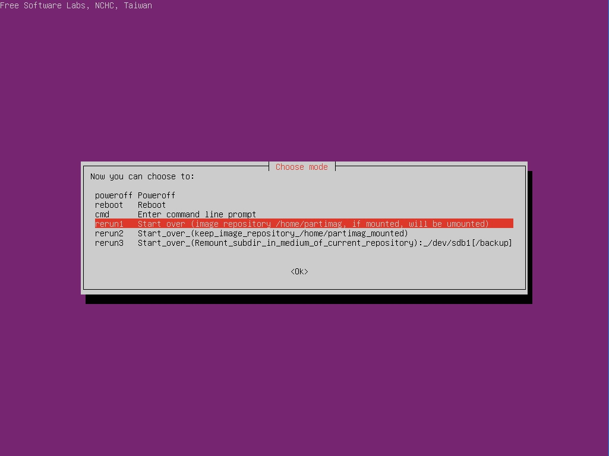

rerun1: Restart everything from step 3
rerun2: Restart from step 3, remembering the folder where you want to save the backup
rerun3: Go back to step 8 and select the backup folder again and start from step 3

When the recovery is over and reboot is selected, a message appears after counting down, when you remove the USB and press Enter to complete all operations.

